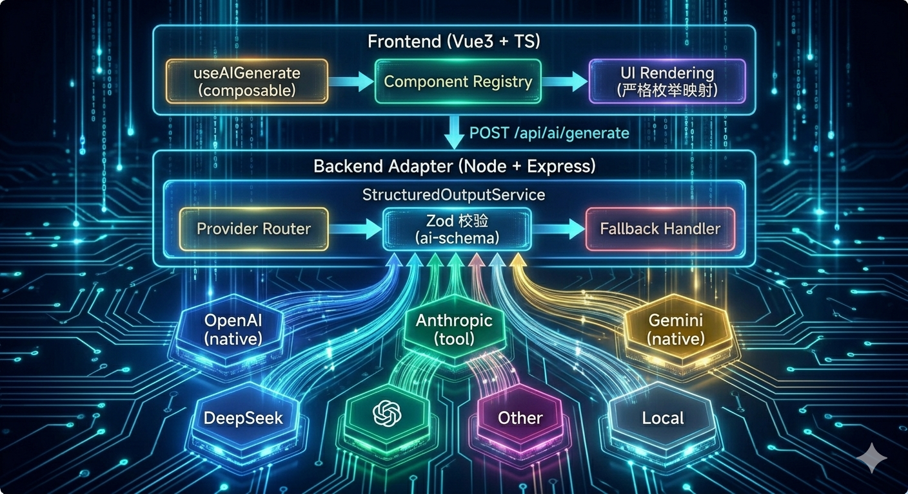

# AI 结构化输出设计方案

> 日期：2026-04-16
> 目标：构建跨模型通用、前后端类型安全、可维护的 AI 结构化输出体系，支撑前端根据 AI 返回数据动态渲染不同 UI 组件。

---

## 1. 背景与目标

### 1.1 问题背景
后端调用不同 AI 模型时，各平台对结构化输出（Structured Output / JSON Schema）的支持能力差异很大：
- OpenAI 原生支持 `response_format.json_schema`，可保证 100% 合法 JSON。
- Anthropic 没有独立的 json_schema response_format，需通过 `tool use` 强制输出。
- Gemini 通过 `generationConfig.responseJsonSchema` 约束。
- 国产/本地小模型（DeepSeek、通义、Ollama 等）无原生支持，只能靠 prompt 约束。

### 1.2 设计目标
1. **通用性**：业务代码不感知底层模型差异，换模型只需改配置。
2. **类型安全**：前后端共享同一套 Zod Schema，端到端类型安全。
3. **可维护性**：后端 Adapter 按模型拆分文件，独立维护。
4. **健壮性**：强模型走原生能力，弱模型 prompt 兜底，失败时返回纯文本供前端展示。
5. **严格组件映射**：前端只渲染白名单内的组件，禁止动态执行任意代码。

---

## 2. 技术方案选型

### 2.1 最终方案：Schema-First Monorepo + BFF Adapter

- **共享层**：`packages/ai-schema` 定义所有 Zod Schema 与组件白名单类型。
- **后端**：Node.js + Express，封装 `StructuredOutputService`，内部按模型拆分 Adapter 文件。
- **前端**：Vue3 + TypeScript，通过 `componentRegistry` 严格枚举映射组件。

### 2.2 未选方案说明
| 方案 | 未选原因 |
|------|---------|
| 纯 Prompt + JSON Schema 校验 | 小模型失败率过高，不适合核心链路 |
| Vercel AI SDK / Edge Gateway | 与当前 Node/Express 后端栈耦合过深，通用性不足 |
| 动态组件协议 / 低代码配置 | 架构过重，类型安全难以保证，超出当前阶段需求 |

---

## 3. 整体架构与数据流

```
┌─────────────────────────────────────────────────────────────┐
│                     Frontend (Vue3 + TS)                    │
│  ┌──────────────┐  ┌──────────────┐  ┌─────────────────┐   │
│  │ useAIGenerate│─▶│ Component    │─▶│ UI Rendering    │   │
│  │ (composable) │  │ Registry     │  │ (严格枚举映射)   │   │
│  └──────────────┘  └──────────────┘  └─────────────────┘   │
└───────────────────────────┬─────────────────────────────────┘
                            │ POST /api/ai/generate
┌───────────────────────────▼─────────────────────────────────┐
│              Backend Adapter (Node + Express)               │
│  ┌─────────────────────────────────────────────────────┐   │
│  │  StructuredOutputService                            │   │
│  │  ┌────────────┐  ┌────────────┐  ┌──────────────┐  │   │
│  │  │ Provider   │─▶│ Zod 校验    │─▶│ Fallback     │  │   │
│  │  │ Router     │  │ (ai-schema)│  │ Handler      │  │   │
│  │  └────────────┘  └────────────┘  └──────────────┘  │   │
│  └─────────────────────────────────────────────────────┘   │
└───────────────────────────┬─────────────────────────────────┘
        ┌───────────────────┼───────────────────┐
        ▼                   ▼                   ▼
   ┌─────────┐       ┌──────────┐       ┌──────────┐
   │ OpenAI  │       │ Anthropic│       │ Gemini   │
   │ (native)│       │ (tool)   │       │ (native) │
   └─────────┘       └──────────┘       └──────────┘
        ▼                   ▼                   ▼
   ┌─────────┐       ┌──────────┐       ┌──────────┐
   │DeepSeek │◄──────┘ 其他模型  └──────►│ 本地模型  │
   │(prompt) │       │(prompt)  │       │(prompt)  │
   └─────────┘       └──────────┘       └──────────┘
```



### 3.1 核心数据流
1. 前端发送 `{ provider, schemaId, prompt, model?, temperature? }` 到 `/api/ai/generate`。
2. `StructuredOutputService` 根据 `provider` 选择对应的模型 Adapter 文件。
3. Adapter 调用 AI API，返回原始文本/JSON。
4. `parseAndValidate` 用 `ai-schema` 中的 Zod Schema 做统一校验。
5. 校验通过 → 返回 `{ success: true, data: { blocks: [...] } }`。
6. 校验失败 → 走弹性提取，仍失败 → 返回 `{ success: false, rawText: ... }`。
7. 前端 `success: true` 时遍历 `blocks` 数组，每个 block 按 `type` 路由：`markdown` 走 Markdown 组件，`component` 走 `componentRegistry` 严格枚举映射；`success: false` 时用单个 `Markdown` 组件展示原始文本。

---

## 4. Adapter 层设计（Node + Express）

### 4.1 目录结构
按模型拆分文件，一个文件只负责一个模型的调用与原始响应返回：

```
backend/
├── adapters/
│   ├── index.ts              # 统一导出 + provider 路由
│   ├── openaiAdapter.ts      # OpenAI Chat Completions / Responses
│   ├── anthropicAdapter.ts   # Anthropic Tool Use
│   ├── geminiAdapter.ts      # Gemini GenerateContent
│   └── fallbackAdapter.ts    # Prompt + 原始返回（DeepSeek/国产/本地）
├── services/
│   └── structuredOutput.ts   # 统一入口：路由 → Adapter → 校验 → Fallback
├── utils/
│   └── resilientParse.ts     # 弹性 JSON 提取器
└── routes/
    └── ai.ts                 # Express Route
```

### 4.2 Adapter 接口契约
所有 Adapter 必须实现同一接口：

```typescript
// adapters/index.ts
import { z } from 'zod';

export interface AdapterOptions {
  prompt: string;
  jsonSchema: any;      // 传给模型原生 API 的 JSON Schema
  model?: string;
  temperature?: number;
}

export interface AdapterResult {
  rawText: string;      // 原始响应文本，供后续提取/校验
}

export type ModelAdapter = (options: AdapterOptions) => Promise<AdapterResult>;

export const adapters: Record<string, ModelAdapter> = {
  openai: require('./openaiAdapter').openaiAdapter,
  anthropic: require('./anthropicAdapter').anthropicAdapter,
  gemini: require('./geminiAdapter').geminiAdapter,
  fallback: require('./fallbackAdapter').fallbackAdapter,
};
```

### 4.3 Adapter 职责边界
- **只做一件事**：把 `prompt + jsonSchema` 发给对应模型，返回原始文本。
- **不做校验**：Zod 校验交给上层的 `structuredOutput.ts`，保证逻辑统一。
- **不做重试**：重试/降级策略也交给上层，Adapter 保持最小化。

### 4.4 示例：openaiAdapter.ts
```typescript
import OpenAI from 'openai';
import type { ModelAdapter, AdapterOptions } from './index';

const client = new OpenAI({ apiKey: process.env.OPENAI_API_KEY });

export const openaiAdapter: ModelAdapter = async (options) => {
  const response = await client.chat.completions.create({
    model: options.model || 'gpt-4o',
    messages: [{ role: 'user', content: options.prompt }],
    response_format: {
      type: 'json_schema',
      json_schema: {
        name: 'structured_output',
        strict: true,
        schema: options.jsonSchema,
      },
    },
    temperature: options.temperature ?? 0.7,
  });

  return { rawText: response.choices[0].message.content || '' };
};
```

### 4.5 示例：anthropicAdapter.ts
```typescript
import Anthropic from '@anthropic-ai/sdk';
import { jsonSchemaOutputFormat } from '@anthropic-ai/sdk/helpers/json-schema';
import type { ModelAdapter, AdapterOptions } from './index';

const client = new Anthropic({ apiKey: process.env.ANTHROPIC_API_KEY });

export const anthropicAdapter: ModelAdapter = async (options) => {
  const message = await client.messages.parse({
    model: options.model || 'claude-sonnet-4-5',
    max_tokens: 4096,
    messages: [{ role: 'user', content: options.prompt }],
    output_config: {
      format: jsonSchemaOutputFormat(options.jsonSchema),
    },
  });

  return { rawText: JSON.stringify(message.parsed_output || {}) };
};
```

### 4.6 示例：fallbackAdapter.ts
```typescript
import type { ModelAdapter, AdapterOptions } from './index';

export const fallbackAdapter: ModelAdapter = async (options) => {
  // 这里用任意 HTTP client 调用目标模型
  // 如 DeepSeek、Ollama、国产模型等
  const systemPrompt = `
You must respond with valid JSON that conforms exactly to the following schema:
${JSON.stringify(options.jsonSchema, null, 2)}

Rules:
1. The top-level object must contain a "blocks" array.
2. Each block must have a "type" field: either "markdown" or "component".
3. For text content, use { "type": "markdown", "content": "..." }.
4. For UI components, use { "type": "component", "component": "DataTable|Chart|Form", "props": { ... } }.
5. Do not wrap the JSON in markdown code blocks.
6. Do not include any explanatory text outside the JSON.
7. Ensure all required fields are present.
`.trim();

  const response = await callGenericLLM({
    model: options.model,
    messages: [
      { role: 'system', content: systemPrompt },
      { role: 'user', content: options.prompt },
    ],
    temperature: options.temperature ?? 0.7,
  });

  return { rawText: response.text };
};
```

---

## 5. Schema 定义规范与组件白名单

### 5.1 共享包结构
```
packages/ai-schema/
├── src/
│   ├── components/
│   │   ├── index.ts
│   │   ├── DataTable.ts
│   │   ├── Chart.ts
│   │   └── Form.ts
│   ├── blocks/
│   │   ├── index.ts          # Block 联合类型定义
│   │   └── markdownBlock.ts
│   ├── schemas/
│   │   ├── index.ts
│   │   └── recipeExtractor.ts
│   └── index.ts
```

### 5.2 Block-based 输出结构
AI 返回的是一个 `blocks` 数组，每个元素要么是 `markdown` 文本块，要么是 `component` 组件块。这样可自由组合“文本 + 组件 + 文本”的混合布局。

```typescript
// src/components/index.ts
import { z } from 'zod';
import { DataTablePropsSchema } from './DataTable';
import { ChartPropsSchema } from './Chart';
import { FormPropsSchema } from './Form';

export const ComponentTypeSchema = z.enum([
  'DataTable',
  'Chart',
  'Form',
]);

export type ComponentType = z.infer<typeof ComponentTypeSchema>;

// 组件 Block
export const ComponentBlockSchema = z.discriminatedUnion('component', [
  z.object({
    type: z.literal('component'),
    component: z.literal('DataTable'),
    props: DataTablePropsSchema,
  }),
  z.object({
    type: z.literal('component'),
    component: z.literal('Chart'),
    props: ChartPropsSchema,
  }),
  z.object({
    type: z.literal('component'),
    component: z.literal('Form'),
    props: FormPropsSchema,
  }),
]);

export type ComponentBlock = z.infer<typeof ComponentBlockSchema>;
```

```typescript
// src/blocks/index.ts
import { z } from 'zod';
import { ComponentBlockSchema } from '../components';

export const MarkdownBlockSchema = z.object({
  type: z.literal('markdown'),
  content: z.string(),
});

export type MarkdownBlock = z.infer<typeof MarkdownBlockSchema>;

export const BlockSchema = z.union([MarkdownBlockSchema, ComponentBlockSchema]);
export type Block = z.infer<typeof BlockSchema>;

// AI 最终输出
export const AIOutputSchema = z.object({
  blocks: z.array(BlockSchema),
});

export type AIOutput = z.infer<typeof AIOutputSchema>;
```

### 5.3 Schema 设计原则
| 原则 | 说明 |
|------|------|
| 避免深层嵌套 | 超过 3 层对象解析失败率显著上升 |
| 少用 `anyOf`/`oneOf` | OpenAI Structured Outputs 支持有限 |
| 字段必须有 `description` | 提升 AI 填对字段的概率 |
| `required` 完整 | 核心信息不依赖 optional |
| 组件与数据分离 | `component` 管 UI，`props` 管数据 |
| 混合布局用 Block 数组 | `blocks` 数组支持文本与组件自由穿插 |
| Prompt 明确说明 Block 类型 | 需告诉 AI `type: "markdown"` 和 `type: "component"` 的用法 |

---

## 6. Fallback / 错误降级流程

### 6.1 三层防线
1. **Prompt 预防**：system prompt 中嵌入完整 schema + 示例 + 输出规则。
2. **弹性提取**：按顺序尝试直接 parse → markdown code block 提取 → 正则提取第一个 `{...}` 或 `[...]`。
3. **安全兜底**：完全提取失败时，返回 `rawText`，前端用 `Markdown` 组件展示。

### 6.2 弹性提取器
```typescript
export function resilientJsonExtract(raw: string): { json: any } | null {
  try {
    return { json: JSON.parse(raw) };
  } catch {}

  const codeBlockMatch = raw.match(/```(?:json)?\s*([\s\S]*?)\s*```/);
  if (codeBlockMatch) {
    try {
      return { json: JSON.parse(codeBlockMatch[1]) };
    } catch {}
  }

  const jsonMatch = raw.match(/(\{[\s\S]*\}|\[[\s\S]*\])/);
  if (jsonMatch) {
    try {
      return { json: JSON.parse(jsonMatch[1]) };
    } catch {}
  }

  return null;
}
```

### 6.3 校验与降级逻辑
```typescript
export async function parseWithFallback(
  rawText: string,
  schema: z.ZodSchema
) {
  const extracted = resilientJsonExtract(rawText);

  if (extracted) {
    const parsed = schema.safeParse(extracted.json);
    if (parsed.success) {
      return { success: true, data: parsed.data };
    }
    return {
      success: false,
      rawText,
      error: `Schema validation failed: ${parsed.error.message}`,
    };
  }

  return {
    success: false,
    rawText,
    error: 'No valid JSON found in response',
  };
}
```

### 6.4 前端 Block 渲染
```vue
<!-- AIRenderer.vue -->
<script setup lang="ts">
import type { Block } from '@your-org/ai-schema';
import DataTable from './DataTable.vue';
import Chart from './Chart.vue';
import Form from './Form.vue';
// 推荐 markstream-vue 作为 Markdown 渲染引擎
import { MarkStream } from 'markstream-vue';

const props = defineProps<{
  blocks: Block[];
}>();

const componentMap = {
  DataTable,
  Chart,
  Form,
} as const;
</script>

<template>
  <div class="ai-content">
    <template v-for="(block, index) in blocks" :key="index">
      <MarkStream v-if="block.type === 'markdown'" :content="block.content" />
      <component
        v-else-if="block.type === 'component'"
        :is="componentMap[block.component]"
        v-bind="block.props"
      />
    </template>
  </div>
</template>
```

**推荐 `markstream-vue` 的原因：**
- 专为 AI 流式输出设计，支持增量渲染、无闪烁
- 支持 Mermaid 渐进式渲染、代码块 Monaco/Shiki 增量高亮
- 支持在 Markdown 中嵌入自定义 Vue 组件
- 社区有 Vue 2 / React 对应版本，生态完整

兜底渲染：
```vue
<template>
  <AIRenderer v-if="result.success" :blocks="result.data.blocks" />
  <MarkStream v-else :content="result.rawText" />
</template>
```

### 6.5 流式策略
本架构采用**后端攒完整 JSON、再一次性返回**的流式策略（方案 A）：
- 后端到 AI 服务器走 `stream=true`，边收边在内存中拼接完整响应。
- JSON 结构完整并通过 Zod 校验后，才通过 HTTP Response 返回给前端。
- 前端在等待期间，可用 `markstream-vue` 配合一个「正在输入…」的占位动画，营造流式感。

**不采用 token 级真流式的原因：**
- OpenAI `json_schema`、Anthropic `tool use`、Gemini `responseJsonSchema` 均只保证**最终输出**合法。
- 中间 token 经常是不完整 JSON，增量解析可靠性低，不适合生产环境。
- 后端攒完再一次性返回 block 数组，能确保前端每个 block 都是完整可渲染的。

---

## 7. 主流平台 response_format 对照清单

| 平台 | API | Schema 参数位置 | 强制开关 | 语法保证 |
|------|-----|----------------|---------|---------|
| **OpenAI (Chat)** | `/v1/chat/completions` | `response_format.json_schema.schema` | `strict: true` | 100% |
| **OpenAI (Responses)** | `/v1/responses` | `text.format.schema` | `strict: true` | 100% |
| **Anthropic** | `/v1/messages` | `tools[].input_schema` | `tool_choice.type: "tool"` | 100% |
| **Gemini** | `generateContent` | `generationConfig.responseJsonSchema` | `responseMimeType: "application/json"` | 高 |
| **Fallback** | 任意 | Prompt 文本嵌入 | 无 | 无 |

### 7.1 Anthropic Tool Use 关键说明
Anthropic 没有 `json_schema` response_format，官方推荐通过以下方式实现结构化输出：
1. 定义一个单一名为 `extract_data`（或业务名）的 tool。
2. 设置 `tool_choice: { type: "tool", name: "extract_data" }` 强制调用。
3. 模型返回的 `tool_use.input` 即为结构化 JSON。
4. TypeScript SDK 提供 `messages.parse()` + `zodOutputFormat()` / `jsonSchemaOutputFormat()` 封装。

### 7.2 Gemini 关键说明
必须同时设置：
```json
{
  "generationConfig": {
    "responseMimeType": "application/json",
    "responseJsonSchema": { ... }
  }
}
```
仅传 `responseJsonSchema` 不生效。

---

## 8. 监控与告警

| 事件 | 处理方式 |
|------|---------|
| `native_success` | 正常通过，可打 info 日志 |
| `fallback_parse_success` | 记录，用于评估弱模型质量 |
| `fallback_parse_fail` | 告警阈值，连续 N 次触发通知 |
| `schema_validation_fail` | 记录原始响应，用于优化 schema/prompt |

---

## 9. 待实现清单

- [ ] 初始化 `packages/ai-schema` 共享包
- [ ] 实现 `backend/adapters/` 下各模型 Adapter 文件
- [ ] 实现 `structuredOutput.ts` 统一服务与校验逻辑
- [ ] 实现 Express Route `/api/ai/generate`
- [ ] 前端 Vue3 `useAIGenerate` composable
- [ ] 前端 `componentRegistry` 严格映射
- [ ] 集成测试（覆盖 OpenAI / Anthropic / Gemini / Fallback 四种路径）
